# Rule-Based Persona Generator

A systematic process for generating realistic personas based on cognitive rules, attribute relationships, and demographic constraints. This system creates consistent, believable character profiles for simulation or gaming environments, with a particular focus on transaction scenarios.

DTS is a sampling algorithm that deliberately inverts MCMC principles to achieve controlled divergence in constrained spaces. While MCMC and VAEs converge toward minimum energy states, DTS systematically explores the valid state space while maintaining constraint satisfaction. The algorithm draws inspiration from statistical physics concepts of entropy maximization, applying them to generate diverse but valid samples within defined constraint boundaries.

## What It Does
- Creates realistic personas using rules + DTS optimization
- Enforces hard constraints (e.g., "doctors need PhDs")
- Optimizes soft relationships (e.g., "risk tolerance affects investment style")

## Three-Layer System

```mermaid
graph TD
    A[Hard Rules] -->|Enforces| B[Basic Generation]
    B -->|Seeds| C[DTF Refinement]
    C -->|Validates| A

    %% Styling
    classDef state fill:#000,stroke:#fff,stroke-width:2px,font-family:Comic Sans MS,font-weight:bold
    classDef decision fill:#000,stroke:#fff,stroke-width:2px,font-family:Comic Sans MS,font-weight:bold
    classDef process fill:#000,stroke:#fff,stroke-width:2px,font-family:Comic Sans MS,font-weight:bold

    class Start,Complete state
    class Diverge,Valid,Diverse decision
    class Root,Spawn,Store process
```



## By The Numbers
- 30% Deterministic (Hard rules that never break)
- 20% Random (Initial generation within rules)
- 50% MCMC (Statistical optimization)

## Quick Example
```yaml
Input:
  role: "Software Engineer"
  rules:
    - needs: ["Bachelor's", "Master's", "PhD"]
    - age: >= 22
    - income: [70k-200k]

Output:
  # Hard Rules (Never Break)
  education: "Master's"
  age: 28
  income: 95k

  # MCMC Optimized (Statistically Refined)
  risk_tolerance: 72%  
  personality:
    openness: 0.8
    conscientiousness: 0.7
  investment_style: "Growth-focused"
```

## Key Points
1. Rules are never broken
2. Initial state is randomly valid
3. DTF makes it realistic
4. More coherent than pure random
5. More diverse than pure rules

## Core Flow

The base algorithm follows this pattern:

```python
def wander_tree(initial_state, constraints, relationships):
    current_node = initial_state
    exploration_tree = []
    
    while not sufficient_diversity:
        # Generate divergent child node
        child = spawn_child_node(current_node)
        
        # Check validity against constraints
        if validate_constraints(child, constraints):
            # Calculate validity score
            score = calculate_validity(child, relationships)
            
            # Accept with probability proportional to validity
            if random() < min(1.0, score/current_score):
                current_node = child
                exploration_tree.append(child)
```

## Key Innovations

1. **Inverted Acceptance Probability**
   - Traditional MCMC: `P(accept) = min(1, π(x')/π(x))`
   - DTS: `P(accept) = min(1, V(x')/V(x))` where V is validity score
   - Forces exploration while maintaining realistic bounds

2. **Adaptive Node Spawning**
```python
num_modifications = max(1, min(4, int(1 + 3 * (1 - recent_acceptance_rate))))
attributes_to_modify = weighted_sample(attributes, size=num_modifications)
```

3. **Relationship Preservation**
- Uses weighted attribute relationships instead of transition kernels
- Maintains statistical validity while allowing divergence
- Handles both categorical and continuous attributes

4. **Constraint Management**
```python
def validate_constraints(node, constraints):
    # Hard constraints (e.g., education requirements)
    if not check_hard_constraints(node):
        return False
        
    # Relationship constraints
    return check_relationship_validity(node)
```

## Advantages Over Traditional Methods

1. **VS. MCMC**
   - Actively promotes diversity rather than convergence
   - Maintains validity through constraints rather than distribution sampling
   - Better handles mixed categorical/continuous spaces

2. **VS. VAEs/GANs**
   - No training required
   - Explicit constraint handling
   - Deterministic validity checks
   - No mode collapse issues

3. **VS. Rejection Sampling**
   - More efficient in high-dimensional constrained spaces
   - Maintains attribute relationships
   - Guided exploration rather than blind sampling

## Implementation Details

The core components work together as follows:

```python
class DivergentTreeSampler:
    def spawn_child_node(self, parent_node):
        # Select attributes to modify based on relationships
        attributes = select_weighted_attributes()
        
        # Generate modifications that promote divergence
        modifications = generate_divergent_changes(attributes)
        
        # Apply while maintaining minimal validity
        return apply_modifications(parent_node, modifications)
        
    def validity_score(self, node):
        # Calculate relationship preservation
        relationship_score = calculate_relationship_score(node)
        
        # Calculate constraint satisfaction
        constraint_score = calculate_constraint_score(node)
        
        return combine_scores(relationship_score, constraint_score)
```

## Statistical Guarantees

While DTS doesn't guarantee convergence to a target distribution (by design), it provides:

1. Constraint Satisfaction: All generated samples meet hard constraints
2. Relationship Preservation: Maintains specified attribute correlations
3. Diversity Maximization: Actively explores valid state space
4. Statistical Validity: Generated populations match specified distributions

## Performance Characteristics

- Time Complexity: O(n * c * r) where:
  - n = number of attributes
  - c = number of constraints
  - r = number of relationships
- Space Complexity: O(t) where t = size of exploration tree
- Acceptance Rate: Typically 30-70% depending on constraint strictness

## Use Cases

Particularly suited for:
- Generating diverse but realistic personas
- Exploring constrained possibility spaces
- Maintaining complex attribute relationships
- Scenarios requiring explicit constraint satisfaction

```mermaid
flowchart TB
    Start([Initial Valid State]) --> Root[Root Node]
    
    
        Root --> Diverge{Diverge?}
        
        Diverge -->|Yes| Spawn[Spawn Child Node]
        Spawn --> Valid{Valid?}
        
        Valid -->|Yes| Store[Store Node]
        Store --> Diverse{Enough<br>Diversity?}
        
        Diverse -->|No| Diverge
        Valid -->|No| Diverge
        
        Diverse -->|Yes| Complete([Complete])
    
    
    %% Styling
    classDef state fill:#000,stroke:#fff,stroke-width:2px,font-family:Comic Sans MS,font-weight:bold
    classDef decision fill:#000,stroke:#fff,stroke-width:2px,font-family:Comic Sans MS,font-weight:bold
    classDef process fill:#000,stroke:#fff,stroke-width:2px,font-family:Comic Sans MS,font-weight:bold

    class Start,Complete state
    class Diverge,Valid,Diverse decision
    class Root,Spawn,Store process
```


---

Basic Usage:
```bash
# Generate 100 personas with default settings
python persona_generator.py

# Generate 500 personas with more iterations for better diversity
python persona_generator.py --num-personas 500 --iterations 2000

# Generate personas without using DTS (simpler but less diverse)
python persona_generator.py --no-wandering --num-personas 100
```

Common Parameters:
```bash
--num-personas N        Number of personas to generate (default: 100)
--iterations N          Number of DTS iterations (default: 1000)
--burn-in N            Initial iterations to discard (default: 100)
--exploration-rate X    Rate of exploration (0-1, default: 0.1)
--output-dir PATH      Output directory (default: 'output')
--debug                Enable detailed logging
--skip-visualizations  Skip generating visualizations
```

Expected Outputs:
```
output/
├── [timestamp]/
│   ├── personas/                    # Generated personas
│   │   ├── [Name1].yaml
│   │   ├── [Name1].json
│   │   └── [Name1].md
│   ├── visualizations/              # Visual analysis
│   │   ├── diagnostics/
│   │   │   ├── wandering_diagnostics_1.png
│   │   │   └── wandering_diagnostics_2.png
│   │   └── personality/
│   │       └── personality_analysis.png
│   └── statistics/                  # Population analysis
│       └── population_statistics.md
```

Example Command with All Options:
```bash
python persona_generator.py \
  --num-personas 200 \
  --iterations 1500 \
  --burn-in 150 \
  --exploration-rate 0.15 \
  --output-dir "my_personas" \
  --debug
```

This will generate:
1. 200 diverse personas
2. Diagnostic visualizations showing the exploration process
3. Personality trait analysis across generations
4. Comprehensive population statistics
5. Detailed generation logs (due to --debug)

The script will maintain distributions of:
- Demographics (age, gender)
- Education levels
- Occupations
- Income ranges
- Personality traits
- Other defined attributes

While ensuring all relationships (like education-occupation, age-retirement, income-occupation) remain realistic according to the configured rules.


# Configuration

1. `attribute_options.yaml`:
This is the primary configuration file that defines all possible attributes and their valid values/ranges. It contains:

- Individual attributes with either ranges or discrete options:
```yaml
# Continuous range attributes
age:
  range: '18-80'
income:
  range: '20000-300000'

# Discrete option attributes
gender:
  options:
    - value: Male
      distribution: 49
    - value: Female
      distribution: 49
    - value: Non-binary
      distribution: 2
```

- Occupation definitions with detailed constraints:
```yaml
occupation:
  options:
    - value: Software Developer
      total_employment: 1656880
      valid_education: [Some College, Bachelor's Degree, Master's Degree]
      valid_income_range: [92589, 171951]
      min_age: 22
      retirement_age: 65
```

2. `attribute_relationships.yaml`:
Defines how different attributes influence each other through weighted relationships:

```yaml
age:
  relationships:
    - secondary_attribute: education_level
      weight: 0.8
      conditions: [age<22]
    - secondary_attribute: occupation
      weight: 0.7
```

Key concepts:
- `weight`: Strength of relationship (-1 to 1)
- `conditions`: When relationships apply
- Can include specific value assignments

3. `persona_template.yaml` and `persona_template.md`:
These define how the generated personas are formatted:

```yaml
template: >
  name: {name}
  description: >
    {name} is a {age}-year-old {gender}...
```

Roles in the Script:

1. AttributeOptions class:
- Loads attribute_options.yaml
- Validates configurations
- Provides methods to get random valid options
- Enforces constraints between attributes

2. AttributeRelationships class:
- Loads attribute_relationships.yaml
- Calculates weighted influences between attributes
- Ensures generated personas maintain realistic relationships

3. PersonaGenerator class:
- Uses both configurations to generate valid personas
- Applies templates for output formatting
- Maintains statistical validity and diversity

4. DivergentTreeSampler class:
- Uses the configurations to explore the valid state space
- Maintains constraint satisfaction while maximizing diversity
- Uses relationships to guide exploration

The YAML configurations effectively create a framework of rules and relationships that guide the generation of realistic, diverse, yet constrained personas. The script uses these to create statistically valid populations while maintaining individual attribute relationships and constraints.
