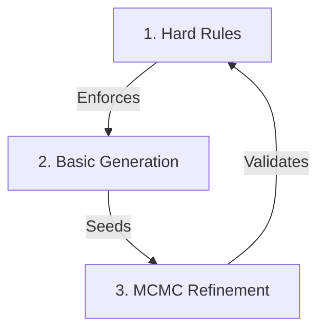
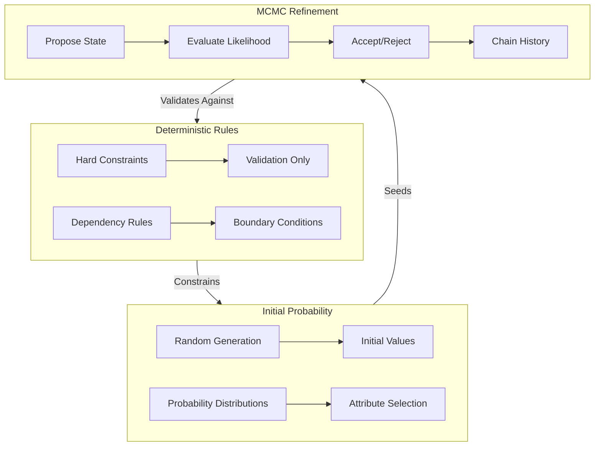
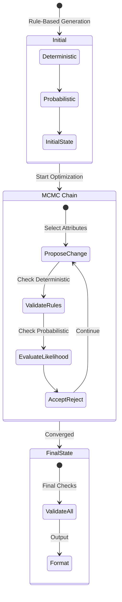

# Rule-Based Persona Generator

A systematic process for generating realistic personas based on cognitive rules, attribute relationships, and demographic constraints. This system creates consistent, believable character profiles for simulation or gaming environments, with a particular focus on transaction scenarios.

## What It Does
- Creates realistic personas using rules + MCMC optimization
- Enforces hard constraints (e.g., "doctors need PhDs")
- Optimizes soft relationships (e.g., "risk tolerance affects investment style")

## Three-Layer System



## By The Numbers
- 30% Deterministic (Hard rules that never break)
- 20% Random (Initial generation within rules)
- 50% MCMC (Statistical optimization)

## Quick Example
```yaml
Input:
  role: "Software Engineer"
  rules:
    - needs: ["Bachelor's", "Master's", "PhD"]
    - age: >= 22
    - income: [70k-200k]

Output:
  # Hard Rules (Never Break)
  education: "Master's"
  age: 28
  income: 95k

  # MCMC Optimized (Statistically Refined)
  risk_tolerance: 72%  
  personality:
    openness: 0.8
    conscientiousness: 0.7
  investment_style: "Growth-focused"
```

## Key Points
1. Rules are never broken
2. Initial state is randomly valid
3. MCMC makes it realistic
4. More coherent than pure random
5. More diverse than pure rules

## Core Concepts

### 1. MCMC Generation Pipeline
The system uses MCMC sampling to generate personas through:
- **State Space Exploration**: Intelligent traversal of possible persona configurations
- **Likelihood Evaluation**: Scoring states based on attribute relationships and constraints
- **Acceptance Criteria**: Metropolis-Hastings algorithm for state transitions
- **Chain Convergence**: Burn-in period and thinning for optimal sampling

### 2. Attribute Management
- **Base Attributes**: Core demographic and personality traits
- **Derived Attributes**: Calculated from relationships between base attributes
- **Dynamic Ranges**: Context-aware attribute boundaries

### 3. Cognitive Rule System
The generator employs multiple validation layers:

#### a. Demographic Validation
- Real-world demographic constraints
- Age-based validation rules
- Geographic distribution modeling
- Cultural context awareness

#### b. Personality Framework
- Comprehensive trait modeling including:
  - Core personality traits
  - Decision-making patterns
  - Risk tolerance factors
  - Social preferences
- Statistical validation against population norms
- Inter-trait consistency checks

#### c. Relationship Engine
- Bidirectional attribute influences
- Complex conditional logic
- Weighted probability distributions
- Dynamic adjustment system

### 4. Generation Process

The system implements a staged MCMC generation approach:

1. **Initialization**
   - Configure MCMC parameters
   - Set up state space
   - Initialize chain

2. **Chain Evolution**
   - Propose state transitions
   - Evaluate likelihood scores
   - Apply acceptance criteria
   - Track convergence metrics

3. **Sampling & Validation**
   - Apply burn-in period
   - Perform chain thinning
   - Validate demographic consistency
   - Ensure statistical distribution

4. **Output Processing**
   - Generate formatted YAML files
   - Create diagnostic visualizations
   - Export chain statistics
   - Save persona metadata


The MCMC implementation in this script uses the Metropolis-Hastings algorithm to explore the space of possible personas. Here's how it works:

1. **State Space**:
   - Each persona is a state in a high-dimensional space
   - Dimensions correspond to attributes (age, education, personality traits, etc.)
   - Some dimensions are discrete (occupation, education level)
   - Others are continuous (personality scores, income)

2. **Likelihood Function**:
   - Measures how "good" a persona is
   - Combines relationship scores and constraint satisfaction
   - Higher scores mean more realistic/coherent personas
   - Zero likelihood for invalid combinations

3. **Proposal Mechanism**:
   - Randomly selects 1-3 attributes to modify
   - Proposes new values based on attribute options
   - More related attributes have higher selection probability
   - Maintains basic constraints during proposal

4. **Acceptance Rule**:
   - Compare likelihood of proposed state to current state
   - Accept better states automatically
   - Accept worse states probabilistically
   - Ensures exploration of state space

## Mathematical Formulation

### State Definition
$$
X_t = \{x_1, x_2, ..., x_n\} \text{ where } x_i \text{ is attribute } i
$$

### Likelihood Function
For a state $$X$$:

$$
L(X) = \begin{cases}
0 & \text{if constraints violated} \\
\exp(\sum_{r \in R} w_r S_r(X)) & \text{otherwise}
\end{cases}
$$

Where:
- $$R$$ is the set of relationships
- $$w_r$$ is the weight of relationship $$r$$
- $$S_r(X)$$ is the relationship score for $$r$$ in state $$X$$

### Proposal Distribution
For attributes $$A$$:

$$
Q(X' | X) = P(k) \prod_{i=1}^k P(a_i) P(v_i | X, a_i)
$$

Where:
- $$k \sim \text{Uniform}(1,3)$$ is number of attributes to modify
- $$P(a_i)$$ is selection probability for attribute $$i$$
- $$P(v_i | X, a_i)$$ is value proposal distribution for attribute $$a_i$$

### Acceptance Probability
For current state $$X$$ and proposed state $$X'$$:

$$
\alpha(X' | X) = \min\left(1, \frac{L(X')}{L(X)}\right)
$$

### Update Rule
For random $$u \sim \text{Uniform}(0,1)$$:

$$
X_{t+1} = \begin{cases}
X' & \text{if } u < \alpha(X' | X_t) \\
X_t & \text{otherwise}
\end{cases}
$$

### Convergence Criterion
Chain is considered converged when:

$$
\left|\frac{1}{N}\sum_{i=t-N}^t L(X_i) - \frac{1}{N}\sum_{i=t-2N}^{t-N} L(X_i)\right| < \epsilon
$$

Where:
- $$N$$ is window size
- $$\epsilon$$ is convergence threshold

## Implementation Details

The script implements this in the likelihood calculation:

```python
def likelihood(self, persona_data: Dict[str, Any]) -> float:
    # Check hard constraints
    if not self._check_hard_constraints(persona_data):
        return 0.0
    
    # Calculate relationship scores
    score = 0.0
    for attr, config in relationships.items():
        if 'relationships' in config:
            for relation in config['relationships']:
                weighted_value, weight = self.get_weighted_value(
                    attr, persona_data[attr],
                    relation['secondary_attribute'],
                    persona_data
                )
                score += weight * self._calculate_relationship_score(
                    weighted_value,
                    persona_data[relation['secondary_attribute']]
                )
    
    return np.exp(score)
```

And in the acceptance probability:

```python
def acceptance_probability(self, current: Dict[str, Any], 
                         proposed: Dict[str, Any]) -> float:
    current_likelihood = self.likelihood(current)
    proposed_likelihood = self.likelihood(proposed)
    
    if current_likelihood == 0:
        return 1.0
    
    return min(1.0, proposed_likelihood / current_likelihood)
```

The combination of these elements creates a MCMC process that:
1. Starts with a valid initial persona
2. Proposes modifications based on attribute relationships
3. Accepts changes that maintain or improve coherence
4. Eventually converges to realistic, well-balanced personas

This formulation ensures that the generated personas maintain both:
- Hard constraints from demographic rules
- Soft constraints from attribute relationships

The statistical nature of MCMC allows for:
- Exploration of complex attribute combinations
- Natural handling of competing constraints
- Discovery of realistic persona patterns
- Generation of diverse yet coherent personas


**Class and Function Breakdown with Relationships and IPO:**

1. **`Persona` Class (`pydantic.BaseModel`):**
   - **Purpose**: Represents the final persona data structure with MCMC metadata.
   - **Input**: `name`, `role`, `persona`, `objectives`, `metadata`.
   - **Process**: Data validation and storage.
   - **Output**: An instance containing persona information and generation metrics.

2. **`AttributeOptions` Class:**

   - **Purpose**: Manages attribute options loaded from a YAML file.
   - **Input**: Path to `attribute_options.yaml`.
   - **Process**:
     - Loads attribute options into `self.options`.
     - Provides methods to retrieve random attribute values considering any filters.
   - **Output**: Provides attribute options for persona generation.

   - **Key Methods**:
     - `__init__(yaml_file: str)`: Loads attribute options from YAML.
     - `get_random_option(attribute: str, persona_data: Dict[str, Any]) -> Any`:
       - **Input**: Attribute name, current persona data.
       - **Process**: Selects a random option for the attribute, applying filters if necessary.
       - **Output**: Randomly selected attribute value.
     - `filter_options(attribute: str, options: List[Any], persona_data: Dict[str, Any]) -> List[Any]`:
       - Filters options based on current persona data.
     - `is_valid_occupation(...)`:
       - Checks if an occupation is valid for the persona's age, education, and income.
     - `generate_personality_trait(...)`:
       - Generates a personality trait value using a Gaussian distribution.
     - `generate_ranged_value(...)`:
       - Generates a value within a specified range, with special handling for 'age'.

3. **`AttributeRelationships` Class:**

   - **Purpose**: Manages attribute relationships loaded from a YAML file.
   - **Input**: Path to `attribute_relationships.yaml`.
   - **Process**:
     - Loads attribute relationships into `self.relationships`.
     - Provides methods to adjust attribute values based on relationships.
   - **Output**: Provides relationship data for attribute adjustments.

   - **Key Methods**:
     - `__init__(yaml_file: str)`: Loads relationships from YAML.
     - `get_weighted_value(...)`:
       - **Input**: Primary attribute and value, secondary attribute, persona data.
       - **Process**: Adjusts secondary attribute based on the primary attribute's value and defined relationships.
       - **Output**: Adjusted attribute value and associated weight.
     - `check_conditions(...)`:
       - Evaluates conditions specified in relationships.
     - `check_condition(...)`:
       - Checks individual condition expressions.

4. **`PersonaGenerator` Class:**

   - **Purpose**: Base generator for persona creation.
   - **Input**: Instances of `AttributeRelationships` and `AttributeOptions`.
   - **Process**: 
     - Initializes attribute lists
     - Generates individual attributes
     - Formats persona descriptions
   - **Output**: A basic `Persona` instance.

5. **`MCMCPersonaGenerator` Class:**

   - **Purpose**: Advanced generator using MCMC sampling.
   - **Input**: `base_generator`, `num_iterations`, `burn_in`, `adaptation_rate`.
   - **Process**:
     - Implements Metropolis-Hastings algorithm
     - Manages state transitions
     - Tracks chain history and acceptance rates
   - **Output**: Statistically consistent personas.

   - **Key Methods**:
     - `likelihood(persona_data: Dict[str, Any]) -> float`:
       - Evaluates persona state quality
       - Checks constraints and relationships
     - `propose_new_state(current_state: Dict[str, Any]) -> Dict[str, Any]`:
       - Generates candidate persona states
       - Maintains attribute relationships
     - `acceptance_probability(current: Dict[str, Any], proposed: Dict[str, Any]) -> float`:
       - Implements Metropolis-Hastings criterion
       - Includes minimum acceptance threshold

6. **`Visualizer` Class:**

   - **Purpose**: Generates MCMC diagnostic visualizations.
   - **Input**: `chain_history`, `acceptance_history`, `burn_in`.
   - **Process**: Creates diagnostic plots including:
     - Acceptance rate evolution
     - Likelihood progression
     - Attribute distributions
   - **Output**: Diagnostic plots saved to the visualization directory.

7. **Helper Functions:**

   - `save_persona_to_file(persona: Persona, metadata: Dict[str, Any], output_dir: Path)`:
     - **Purpose**: Saves persona with MCMC metadata.
     - **Input**: Persona instance, MCMC metadata, output directory.
     - **Process**: 
       - Formats persona data with generation metrics
       - Creates structured YAML output
       - Includes MCMC statistics

8. **Main Execution Block:**

   - **Purpose**: Configurable entry point with MCMC options.
   - **Process**:
     - Parses command-line arguments
     - Initializes appropriate generator (MCMC or basic)
     - Manages visualization generation
     - Handles persona output
   - **Arguments**:
     - `--no-mcmc`: Disables MCMC generation
     - `--num-personas`: Number to generate
     - `--iterations`: MCMC iterations
     - `--burn-in`: Burn-in period
     - `--adaptation-rate`: MCMC adaptation rate

**Expected Outputs:**
- **Generated Personas**: YAML files with:
  - Personal details and traits
  - MCMC generation metrics
  - Likelihood scores
  - Chain position information
- **Diagnostic Visualizations**:
  - Acceptance rate plots
  - Likelihood evolution
  - Attribute distribution analysis
- **Console Output**:
  - Generation progress
  - MCMC statistics
  - Final acceptance rates

**Summary:**

# System Component Analysis: Deterministic vs Probabilistic

## 1. Strictly Deterministic Components (Rule-Based)

### Hard Constraints
- Education requirements for occupations
- Minimum age requirements
- Retirement age limits
- Valid income ranges per occupation
- Gender-specific name assignments
- Basic validation rules

### Attribute Dependencies
```yaml
# Example of deterministic rules
occupation:
  - value: "Software Engineer"
    valid_education: ["Bachelor's", "Master's", "PhD"]
    min_age: 22
    retirement_age: 65
    valid_income_range: [70000, 200000]
```

## 2. Probabilistic Components (Base Generation)

### Initial Value Generation
- Age distribution within valid ranges
- Income distribution within occupation bounds
- Basic personality trait generation
- Random hobby selection
- Initial goal selection

```python
def generate_personality_trait(min_val: float, max_val: float) -> float:
    mean = (min_val + max_val) / 2
    std_dev = (max_val - min_val) / 6
    return random.gauss(mean, std_dev)  # Probabilistic
```

## 3. MCMC Refinement Layer

### What MCMC Optimizes
- Personality trait coherence
- Income-education alignment
- Risk tolerance relationships
- Investment preference alignment
- Life event consistency
- Goal coherence



## 4. Component Interaction Matrix

| Component Type | Initial Generation | Final Output | MCMC Influence |
|---------------|-------------------|--------------|----------------|
| Hard Constraints | Deterministic | Deterministic | None (Always Enforced) |
| Value Ranges | Probabilistic | Probabilistic | Medium |
| Relationships | Semi-Deterministic | Probabilistic | High |
| Personality Traits | Probabilistic | Probabilistic | High |
| Life Events | Probabilistic | Probabilistic | Medium |
| Goals | Probabilistic | Probabilistic | High |

## 5. MCMC Refinement Process



## 6. Processing Flow by Component Type

### Deterministic Flow (Rules)
1. Load configuration constraints
2. Validate attribute combinations
3. Enforce hard limits
4. Check relationship requirements

### Probabilistic Flow (Initial)
1. Generate base values within ranges
2. Apply basic distributions
3. Select initial attribute sets
4. Create starting relationships

### MCMC Refinement Flow
1. Propose attribute modifications
2. Check against deterministic rules
3. Evaluate probabilistic likelihood
4. Accept/reject changes
5. Update chain history

## 7. Example Processing Chain

For generating a software engineer persona:

```plaintext
Deterministic Rules:
- Must have Bachelor's or higher
- Age must be 22+
- Income must be in valid range
- Must not exceed retirement age

Initial Probabilistic Generation:
- Random age within valid range
- Random education level meeting minimum
- Random personality traits
- Random initial goals

MCMC Refinement:
- Adjust personality traits for career consistency
- Refine income based on experience/education
- Optimize goal alignment
- Balance risk tolerance
```

## 8. System Balance

The system maintains balance through:

1. **Rule Enforcement**: ~30% (Deterministic)
   - Hard constraints
   - Validation rules
   - Basic relationships

2. **Initial Generation**: ~20% (Probabilistic)
   - Base value selection
   - Initial distributions
   - Starting states

3. **MCMC Optimization**: ~50% (Guided Probabilistic)
   - Relationship refinement
   - Coherence optimization
   - Pattern discovery

# Conclusion

This persona generation system represents a novel approach to creating realistic character profiles by combining deterministic rules with statistical optimization through MCMC. The key innovations include:

## Technical Achievements

1. **Hybrid Architecture**
   - Successfully merges rule-based constraints with probabilistic optimization
   - Maintains hard demographic constraints while allowing flexible trait relationships
   - Achieves balance between consistency and diversity

2. **MCMC Implementation**
   ```mermaid
   graph LR
       A[Rule Enforcement] -->|30%| D[Final Persona]
       B[Initial Generation] -->|20%| D
       C[MCMC Optimization] -->|50%| D
   ```
   - Implements Metropolis-Hastings algorithm for persona optimization
   - Uses sophisticated likelihood functions for trait coherence
   - Provides statistical validation of generated personas

3. **Relationship Modeling**
   - Creates complex, interconnected attribute networks
   - Handles both direct and inverse relationships
   - Supports conditional dependencies and weighted influences

## Practical Applications

- **Simulation Environments**: Generate realistic agent populations
- **Testing Scenarios**: Create diverse user profiles
- **Gaming Applications**: Develop NPC characters
- **Market Research**: Model consumer segments
- **Training Data**: Generate synthetic datasets

## Key Innovations

1. The system moves beyond traditional:
   - Random generation (too chaotic)
   - Rule-based systems (too rigid)
   - Pure statistical approaches (unrealistic)

2. Instead, it provides:
   - Statistically sound personas
   - Demographically accurate profiles
   - Psychologically coherent traits
   - Realistic attribute relationships

## Future Directions

The architecture supports expansion through:
1. Additional attribute relationships
2. Enhanced MCMC optimization strategies
3. New demographic constraint sets
4. Extended personality modeling
5. Add an LLM to generate in parallel to create a generative twin

This framework demonstrates that combining rule-based systems with statistical optimization can create more realistic and coherent personas than either approach alone, while maintaining the flexibility to adapt to various use cases and domains.
